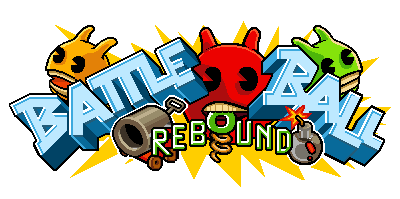

  

 

# PixiJS Battleball

This project aims to demonstrate the use of PixiJS and Colyseus while re-creating Habbo's classic mini-game Battleball.

## The Game

> "To play Battleball, you must have at least two teams, a red team and a blue team, if there are four teams, then green and yellow teams are added. Basically, all you have to do in Battleball is to bounce over squares arranged in a certain way for each stage, on your space hopper. You must bounce on a square three times to "lock" it, it will then become brightly lit up and no-one can go over it again" - [Habbo Fandom](https://habbo.fandom.com/wiki/Battleball)

## Technical requirements
- [ ] Isometric view.
- [ ] Click-based movement.
- [ ] Player can't move to an occupied tile.
- [ ] Player has a bounce animation at all times.
- [ ] Tile is painted with the Player's team color when the Player enters it.
- [ ] Tiles have 3 stages of painting, becoming locked in the last one.
- [ ] 4 teams, Red, Blue, Green, and Yellow.
- [ ] Game ends when all the tiles are painted and locked or run out of time.

## 📝 License

This project is done for educational purposes and under an MIT license.  See the file [LICENSE](LICENSE) for more details.